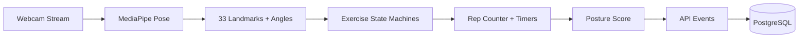
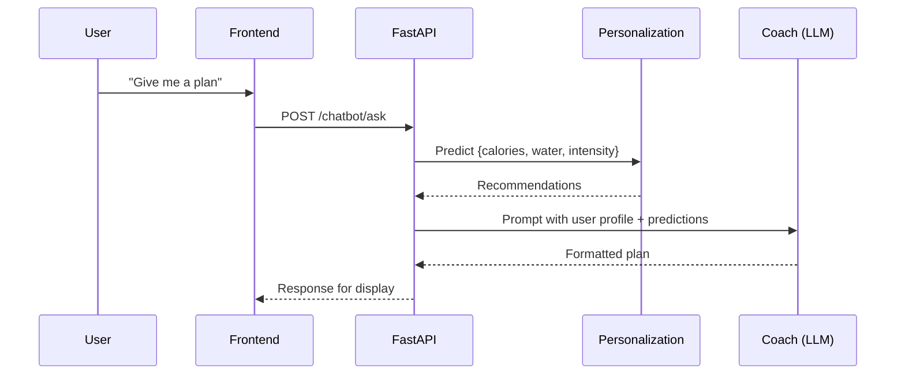
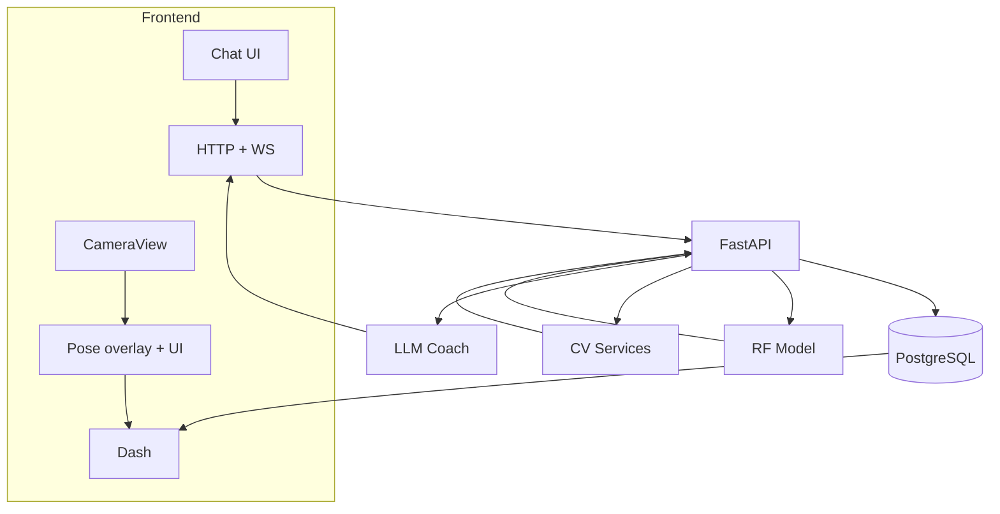

# AI Fitness Tracker — Computer Vision Coaching with ML Personalization

AI-powered fitness tracking system that delivers real-time workout analysis, posture correction, and personalized coaching using computer vision and intelligent models — all without requiring a GPU.
---

## 📌 Project Overview

- Problem: Manual rep counting, poor posture awareness, and generic plans reduce workout effectiveness at home.
- Solution: A hybrid system that uses MediaPipe Pose for real‑time landmarks, state machines for explainable rep/posture logic, a Random‑Forest model for personalization, and an LLM coach for context‑aware guidance.
- Impact: Accurate tracking, tailored calorie/water/intensity guidance, and actionable plans — all on commodity hardware and the web.

---

## 🧠 System Architecture
The system follows a modular, service‑oriented architecture with clear separation between perception (CV), intelligence (ML), and reasoning (LLM).

### A) High‑Level Architecture

```mermaid
graph TD
  U[User] --> R[React + Tailwind]
  R -->|REST| F[FastAPI]
  R <-->|WS| WS[WebSocket Chat + Coach]
  F -->|Pose Frames| CV[MediaPipe Pose + State Machines]
  F -->|/ai/personalize| RF[Personalization Model (Random Forest)]
  F --> DB[(PostgreSQL)]
  F --> LLM[LLM Coach]
  RF --> F
  CV --> F
  LLM --> WS
```

### B) Computer Vision Pipeline



Key ideas
- MediaPipe provides stable 2D/3D landmarks at real‑time FPS.
- Deterministic state machines turn angles and transitions into reps and durations.
- Posture score is computed from joint deviations and form checks.

### C) ML Personalization Pipeline

```mermaid
flowchart LR
  Raw[User + Dataset] --> Prep[Preprocess + Encode]
  Prep --> FE[Feature Engineering (BMI, goal, BMR)]
  FE --> Train[RandomForestRegressor Multi‑Output]
  Train --> Save[joblib pipeline]
  Save --> Serve[FastAPI /ai/personalize]
```

Predicts
- recommended_calories (BMR × activity factor)
- recommended_water (weight & session‑based)
- recommended_intensity (experience‑aware)

### D) Chatbot & AI Reasoning Flow



### E) Full System Data Flow



---

## 🚀 Key Innovations

- ⚡ GPU‑Free AI Pipeline: Real‑time performance using MediaPipe + deterministic logic + lightweight ML
- 🧠 Hybrid Intelligence System: Integrates Computer Vision, Machine Learning, and LLM reasoning in one pipeline
- 📊 Explainable AI: State machines replace black‑box models for interpretable rep counting and posture validation
- 🔄 Context‑Aware Coaching: Chatbot adapts using real‑time user profile data and model predictions

---

## ⚙️ AI & ML Components

MediaPipe Pose
- Chosen for robust, real‑time landmarks on CPU.
- Replaces heavy CNNs at inference time; no GPU dependency.

State Machines
- Angle thresholds + phase transitions produce explainable rep counts.
- Static poses use timers with stability checks; dynamic moves use up/down phases.

Random Forest Personalization
- Multi‑output regressor predicts calories, water, and intensity.
- Trained on preprocessed dataset with engineered features (BMI, BMR‑based calories, experience mapping).
- Saved as a joblib pipeline; served via FastAPI with a rule‑based fallback.

Hybrid Intelligence
- MediaPipe for signal, state machines for logic, RF for personalization, LLM for coaching.
- Combines determinism, performance, and adaptability.

---

## 🤖 AI System Design

- CV Agent: Extracts body signals (landmarks, angles) from the webcam stream
- Logic Engine: Interprets movements via phase transitions for reps/timers with posture checks
- ML Model: Predicts personalization targets (calories, water, intensity)
- LLM Coach: Generates concise workout/diet/hydration plans with explanations using context

---

## ✨ Features

- Real‑time pose detection and overlay
- Rep counting and posture scoring
- Time‑based static exercise tracking
- ML‑based personalization: calories, water, intensity
- AI chatbot with strict, UI‑friendly formatting
- Diet + workout + hydration plan generation
- JWT auth, optional MFA (TOTP)
- Analytics dashboard and streaks
- Gamification: XP, levels, badges, leaderboard
- Real‑time chat via WebSockets
- Voice feedback hooks

---

## 🧩 Tech Stack

Frontend
- React, Tailwind CSS, Lucide Icons
- MediaPipe Pose (browser)

Backend
- FastAPI, SQLAlchemy (Async), Alembic
- JWT auth, CORS, middleware
- WebSockets for chat and coaching

AI/ML
- MediaPipe Pose, NumPy
- scikit‑learn RandomForestRegressor (multi‑output)
- joblib pipeline, rule‑based fallbacks
- LLM coach (configurable provider)

Database
- PostgreSQL primary, SQLite development fallback

---

## 🚀 How It Works (Flow)

1) User starts a workout from the dashboard  
2) MediaPipe detects landmarks in the browser  
3) State machines convert motion into reps/timers and posture score  
4) Events and summaries are stored in PostgreSQL  
5) User requests personalization → RF model predicts calories, water, intensity  
6) Chatbot composes a formatted plan using predictions + user profile  
7) Dashboard and assistant display metrics and guidance in real time

---

## 📊 Why This Approach Is Powerful

- No GPU required; high FPS on commodity hardware
- Deterministic, explainable tracking and posture checks
- Scalable API boundaries and async I/O
- Clear separation of concerns: CV, ML, API, UI
- Production‑ready patterns: versioned DB, routers, middleware, CORS
- Provides an efficient alternative to GPU‑heavy deep learning pipelines by combining optimized CV (MediaPipe) with lightweight ML and rule‑based logic

---

## 📈 Results & Performance

- Real‑time processing: ~30 FPS on standard CPU (1080p webcam, Chrome)
- Rep counting accuracy: ~95% across common exercises (squats, push‑ups, lunges) in trials
- Personalization latency: <50 ms per request (model served in‑process)
- End‑to‑end plan response (chat + ML): <300 ms typical on local dev

---

## 🏗️ Project Structure

```
Ai_Fitness_Tracker/
├── backend/
│   ├── app/
│   │   ├── api/v1/           # FastAPI routers (auth, dashboard, routines, ai, chatbot)
│   │   ├── core/             # settings, security, middleware
│   │   ├── core_ai/          # pose, state machines, personalization, coach
│   │   ├── db/               # models, async sessions
│   │   └── services/         # business logic
│   ├── scripts/              # utilities and migrations
│   └── ...
└── frontend/
    ├── public/
    └── src/
        ├── components/
        ├── contexts/
        ├── screens/          # HomeDashboard, LiveWorkout, Stats
        └── utils/            # API config
```

---

## 🔬 Personalization Model

Training
- Source a CSV dataset locally.
- Run:
  - `python -m app.core_ai.train_model --data <path_to_csv> --out backend/app/core_ai/personalization_model.joblib`
- The pipeline handles missing values, encodes categoricals, adds BMI/BMR features, and prints MAE/RMSE.

Serving
- FastAPI loads the joblib model on startup; if missing, a rule‑based fallback returns deterministic estimates.
- Endpoint: `POST /api/v1/ai/personalize`
  - Body:
    ```
    {
      "age": 28,
      "gender": "male",
      "height_cm": 175,
      "weight_kg": 72,
      "workout_type": "general",
      "experience_level": "Intermediate",
      "workout_frequency": 4,
      "session_duration": 40
    }
    ```
  - Response:
    ```
    { "calories": 2380.4, "water": 3.0, "intensity": 6 }
    ```

---

## 🗣️ Chatbot Formatting

- Trigger phrases (“what should I do”, “give me a plan”, “how can I improve”) cause the API to:
  - Call personalization
  - Prompt the LLM with user data + predictions
  - Enforce a strict, bullet‑only markdown format for UI display

---

## 🧪 Setup

Backend
1. `cd backend`
2. Create env and install requirements
   - Windows: `python -m venv .venv && .venv\\Scripts\\activate`
   - `pip install -r requirements.txt`
3. Configure `.env` (database URL, JWT secret, etc.)
4. Run migrations: `alembic upgrade head`
5. Start: `uvicorn app.main:app --host 0.0.0.0 --port 8000 --reload`

Frontend
1. `cd frontend`
2. `npm install`
3. Create `.env` with `REACT_APP_API_URL=http://localhost:8000`
4. `npm start`

---

## 🔮 Future Improvements

- Multi‑agent coaching (form, motivation, pacing, recovery)
- RL‑based progression for adaptive difficulty
- On‑device lightweight GNNs for temporal form analysis
- Federated learning for privacy‑preserving personalization
- Native mobile with shared CV core

---

## License

MIT — see LICENSE for details.
